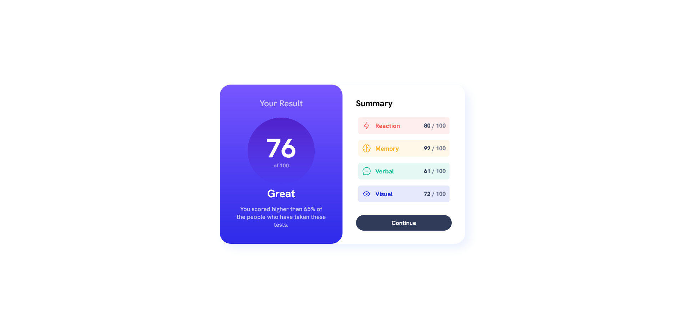
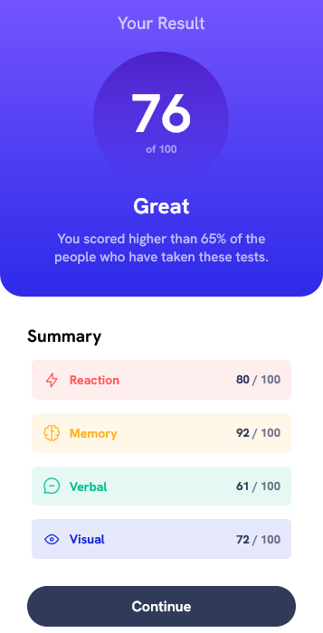

# Frontend Mentor - Results summary component solution

This is a solution to the [Results summary component challenge on Frontend Mentor](https://www.frontendmentor.io/challenges/results-summary-component-CE_K6s0maV). Frontend Mentor challenges help you improve your coding skills by building realistic projects. 

## Table of contents

- [Overview](#overview)
  - [The challenge](#the-challenge)
  - [Screenshot](#screenshot)
  - [Links](#Links)
- [My process](#my-process)
  - [Built with](#built-with)
- [Author](#author)

## Overview

### The challenge

Users should be able to:

- View the optimal layout for the interface depending on their device's screen size
- See hover and focus states for all interactive elements on the page
### Screenshot
- Desktop
---

- Mobile
---

### Links

- Solution URL: [My solution](https://www.frontendmentor.io/profile/Sherif-Nabil/solutions)
- Live Site URL: [Live site URL](https://sherif-nabil.github.io/Results_summary_component_challenge/)

## My process

### Built with

- Semantic HTML5 markup
- CSS custom properties
- Flexbox
- Desktop-first workflow

## Author

- Frontend Mentor - [@Sherif_Nabil](https://www.frontendmentor.io/profile/Sherif-Nabil)